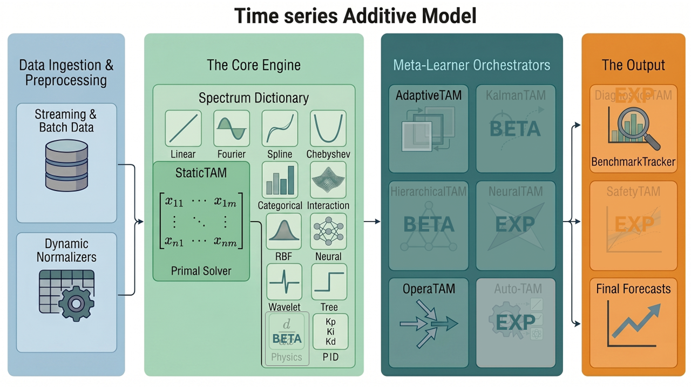

# TAM (Time series Additive Model)

[🧪 `EXAMPLES`](EXAMPLES.md) | [📚 `THEORY`](THEORY.md) | [📄 `JOSS PAPER`](paper.md)

[](https://pypi.org/project/tam-ml/)
[](https://pytorch.org/)
[](#) 
[](https://opensource.org/licenses/LGPL-3.0)
[](https://www.python.org/downloads/)
[](https://github.com/EDF-Lab/tam)
[](https://doi.org/10.5281/zenodo.20543272)

**The unified framework for interpretable, physics-informed, and high-performance time series forecasting.**

TAM gives you the transparency of standard statistical models (like linear regression and splines) with the raw processing power and scale of deep learning. Build your model using simple formula syntax, and our engine will resolve it efficiently on modern GPU architectures via PyTorch, featuring a glass-box architecture with isolated, interpretable components, robust memory management, and exact mathematical resolution.

-----

## 🎯 Statement of Need (Why TAM?)

Traditional Generalized Additive Models (GAMs) are strictly bound by CPU limits, making them computationally intractable for massive datasets and highly complex feature topologies. Furthermore, exact dual kernel methods like Gaussian Processes suffer from a temporal scaling bottleneck, preventing them from handling long, high-frequency time series.

**TAM bridges the gap between classical statistics and modern tensor algebra.** By solving a global convex optimization problem strictly in the Primal space, TAM completely bypasses the dual inversion bottleneck. To prevent Out-Of-Memory (OOM) crashes on extreme scales, TAM's hardware-aware dispatcher protects the system on two fronts: it utilizes **Group-Chunking** to safely process infinite data volumes, and automatically routes massive feature spaces to a matrix-free **Sparse Conjugate Gradient** solver. This allows researchers to scale interpretable learning directly within GPU/CPU caches.

-----

## ⚙️ Stable Framework (v1.2+)

These modules form the mathematically proven, production-ready core of the framework, designed for robust industrial deployment and evaluated for JOSS:

* **Machine Learning for Time Series:** TAM projects a matrix of exogenous features into a finite-dimensional space via basis mappings against a target.

* **Core (`StaticTAM`):** Fits the optimal linear model via primal resolution, with optional joint tuning of:
  * the ridge penalty $\lambda$ using Generalized Cross-Validation (GCV),
  * other hyperparameters via Multi-Start Coordinate Descent.
* **Adaptive (`AdaptiveTAM`):** Corrects residuals in real-time using parallel sliding-windows to handle concept drift.
* **Expertise (`OperaTAM`):** Aggregates external expert models dynamically with mathematical regret bounds.
* **Evaluation (`BenchmarkTracker`):** Tracks temporal degradation, calculates NaN-safe metrics, and analyzes residual autocorrelation.

-----

## 🔬 Experimental Research Lab (BETA / EXP)

We actively collaborate with the academic community to push the boundaries of TAMs. These modules are under active theoretical development:

* **Physics-Informed (`UniversalPhysicsEffect`) (BETA):** Embeds physical laws (ODEs/PDEs) directly into the model as analytical regularization constraints.
* **Dynamic (`KalmanTAM`) (BETA):** Tracks evolving behaviors and coefficients over time via an Extended Kalman Filter.
* **Hierarchy (`HierarchicalTAM`) (BETA):** Optimizes parent/child series simultaneously in the Primal space (National = Sum of Regions).
* **AutoML (`AutoTAM`) (EXP):** Evolutionary Search to discover optimal GAM topologies using successive halving & parsimony pruning.
* **Hybrid (`NeuralTAM`) (EXP):** Integrates Deep Neural Networks via orthogonal residual backfitting to capture extreme non-linearities.
* **Safety (`SafetyTAM`) (EXP):** Provides statistically guaranteed confidence intervals via Adaptive Conformal Inference (ACI).

-----

## 🏗️ System Architecture Overview

The modern architecture (v1.2.1+) is divided into four distinct tiers: Data Ingestion & Preprocessing, the Core Engine, the Meta-Learner Orchestrators, and Output Management.

<div align="center">
  
</div>

Raw data flows through dynamic normalizers before being processed by the `StaticTAM` core. The outputs can then be wrapped by advanced Meta-Learners (like `AdaptiveTAM` or `OperaTAM`) to handle real-world constraints like data drift, risk bounds, multi-level aggregation, and stochastic state tracking.

-----

## 🛠️ Installation

```bash
pip install tam-ml
```

> ⚠️ **Hardware Note:** TAM relies heavily on PyTorch for VRAM management and tensor acceleration. Ensure you have installed the correct PyTorch distribution (CUDA for NVIDIA, or MPS for Apple Silicon) for your specific hardware to fully leverage the framework's GPU capabilities.

---

## 🧩 The Dictionary of Effects

TAM is designed as a framework where you build models by summing generic "Effects".

To understand the deep mathematical behavior of the framework, click on any effect to read its complete theoretical documentation (including its mapping function and structural penalty):
**[Linear](math/spectrum/LINEAR.md)** / **[Fourier](math/spectrum/FOURIER.md)** / **[Spline](math/spectrum/SPLINES.md)** / **[Chebyshev](math/spectrum/CHEBYSHEV.md)** / **[Categorical](math/spectrum/CATEGORICAL.md)** / **[Interaction](math/spectrum/CROSS_TENSOR.md)** / **[RBF](math/spectrum/RBF.md)** / **[Neural](math/spectrum/NEURAL.md)** / **[Tree](math/spectrum/TREE.md)** / **[Linear Tree](math/spectrum/LINEAR_TREE.md)** / **[Wavelet](math/spectrum/WAVELETS.md)** / **[PID](math/spectrum/PID.md)** / **[Physics](math/spectrum/PHYSICS_PIKL.md)** (BETA)

---

## 🚀 Quick Start

Fit a standard interpretable model on historical data using an R-style formula syntax.

> 💡**For Scikit-Learn Users:** You do not need to manually split your target `y` and feature matrix `X`. The framework parses the formula string to dynamically extract the target and build the tensor matrices directly from your Pandas DataFrame.

```python
import pandas as pd
import numpy as np
import tam as ta
from importlib import resources

# 1. Load Data
df = pd.read_csv(resources.files('tam.data').joinpath('airpassengers.csv')).dropna().copy()
df['date'] = pd.to_datetime(df['date'])
d_dict = {'train': df.iloc[:-24], 'test': df.iloc[-24:]}

# 2. Define competing architectures via formulas
f1 = "log_passengers ~ c(month, topo='fourier', ap=-8.0) + l(lag_log_passengers, ap=-30.0)"
f2 = "log_passengers ~ n(month) + l(lag_log_passengers, ap=-30.0)"

# 3. Fit and predict standard models
df['E1'] = ta.StaticTAM(formula=f1, date_col="date").fit(d_dict['train']).predict(df)["Estimatedlog_passengers"].values
df['E2'] = ta.StaticTAM(formula=f2, date_col="date").fit(d_dict['train']).predict(df)["Estimatedlog_passengers"].values

# 4. Dynamically aggregate experts using OperaTAM
opera = ta.OperaTAM("log_passengers ~ l(E1) + l(E2)", algorithm='MLPOL', date_col='date', horizon_steps=12)
df['OPERA'] = opera.predict_online(df)['prediction_opera'].values

# 5. Evaluate and plot
for name, col in [("Expert 1", "E1"), ("Expert 2", "E2"), ("OPERA", "OPERA")]:
    tr = ta.BenchmarkTracker(name)
    tr.y_pred_full = np.exp(df[col].values)
    tr.slice_and_evaluate(d_dict, target_col='value')
    print(f"[{name}] Test MAPE: {tr.get_metric('test', 'MAPE'):.2f}%")

opera.plot_weights(df=df)
```

---

## 📂 Project Structure & Documentation

* **`src/tam/`** - 🐍 SOURCE CODE
* **`math/`** - 🧠 THE "WHY": Mathematical theory, theorems, and RKHS equations.
* **`architecture/`** - 💻 THE "HOW": PyTorch OOP, VRAM management, and code extraction.

Read the full documentation:

* **[🧠 The Math (The "Why")](math/core/01_primal_model.md):** Deep dive into the Primal Solver, Sobolev Spaces, and RKHS.
* **[💻 The Architecture (The "How")](architecture/core/01_additive_api.md):** Explore the Object-Oriented PyTorch implementation and OOM-safe memory dispatching.
* **[🧪 Gallery of Examples](EXAMPLES.md):** Runnable scripts covering Finance, Energy, Medicine, and Physics.

---

## 👥 Project & Community

* **[👥 Authors & Contributions](AUTHORS.md):** Meet the team behind TAM.
* **[🔬 Scientific Background & Acknowledgements](ACKNOWLEDGEMENTS.md):** Academic references and BibTeX for the foundational papers.
* **[🤝 Contributing](CONTRIBUTING.md):** Read our strict Mirror Architecture guidelines before submitting a PR.

---

## Citation

If you use these packages in your research, please cite them using their permanent archives:
* **TAM:** [https://doi.org/10.5281/zenodo.20543272](https://doi.org/10.5281/zenodo.20543272)

**TAM**
```bibtex
@misc{tam2026package,
  title={TAM: Time series Additive Model (v1.2.3)},
  author={Allioux, Yann and Doumeche, Nathan and Bedek, Eloi},
  year={2026},
  doi={10.5281/zenodo.20543272}
}
```

---

## 🐛 Issues & Support

* Found a bug or VRAM leak? Please open an **Issue** on our repository with a minimal reproducible example.
* Have a question about the math? Check the [`📚 THEORY`](THEORY.md) manual or start a **Discussion**.

---

## Status Flags

- **(BETA)**: Active research module. Mostly functional but not fully validated.
- **(EXP)**: Experimental or incomplete. May not function reliably.