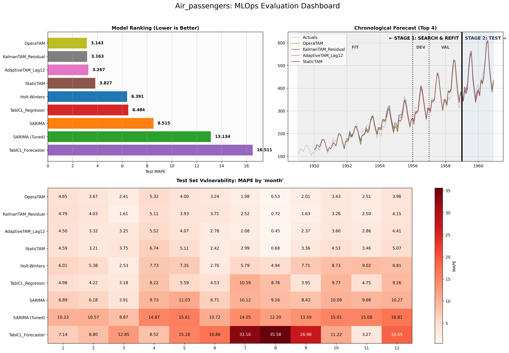

# Summary

Modern statistical learning is often fractured across disparate paradigms. Deep learning scales massively on GPUs but relies on non-convex, stochastic gradient descent heuristics that lack structural interpretability. Conversely, traditional Generalized Additive Models (GAMs) offer mathematical exactness, transparency, and statistical guarantees, but are inherently bound by CPU limits, and, at worst, by exact dual-kernel inversions or non-optimized iterative loop algorithms, that prevent them from scaling to massive industrial datasets.

The **Time series Additive Model (TAM)** is an open-source Python framework that bridges this gap. By strictly projecting heterogeneous functional bases, including splines [@eilers1996flexible; @wood2017generalized], Fourier [@harvey1989forecasting; @doumeche2025forecasting], wavelets [@amato2021forecasting; @mallat1999wavelet], trees [@breiman2017classification; @scornet2016random], neural representations [@le2007continuous; @jacot2018neural; @agarwal2021neural], and physical differential equations [@doumeche2025physics], into a finite Reproducing Kernel Hilbert Space (RKHS) [@aronszajn1950theory; @bach2024learning], TAM formulates an exact Primal Ridge optimization [@hoerl1970ridge]. Accelerated by PyTorch [@paszke2019pytorch], matrix-free Conjugate Gradient solvers [@golub1996matrix], and safe group-chunking, TAM allows researchers to scale interpretable learning directly within modern hardware caches.

# Statement of Need

Forecasting complex time series requires capturing highly non-linear, interacting, and non-stationary dynamics [@pierrot2011short]. While standard GAM frameworks like `mgcv` [@wood2017generalized; @wood2025package] and `pyGAM` [@daniel_serven_2025_17981758] are mathematically robust, they are historically constrained to splines and rely on inverting dense matrices on the CPU, severely bottlenecking their application on "Gigadata" ($N_{total} > 10^6$). 

Conversely, modern deep learning architectures designed for interpretability, such as Neural Additive Models (NAMs) [@agarwal2021neural] and hierarchical sequence models like N-BEATS [@oreshkin2020n], scale efficiently but rely on highly non-convex backpropagation. These models remain plagued by fundamental optimization pathologies, vanishing gradients, ill-conditioning, and saddle points [@lecun1998efficient], and lack the absolute global convergence guarantees of exact kernel methods. 

While the foundational WeaKL algorithm resolved the dual bottleneck for global Fourier bases [@doumeche2025forecasting], it lacked the topological diversity required for complex real-world data. Nevertheless, WeaKL introduced a mathematical formulation of exact primal resolution accelerated by PyTorch [@paszke2019pytorch], two foundational concepts that TAM is expanding.

TAM fundamentally bridges this gap by expanding exact primal resolution to a vast, unified spectrum of effects. It scales the time complexity to $\mathcal{O}(G \times T \times D^2 + G \times D^3)$ [@kim2004smoothing]. For massive topological interactions where the feature dimension $D$ exceeds standard VRAM limits, TAM utilizes a Sparse Conjugate Gradient solver combined with dynamic group-chunking to evaluate the system iteratively, collapsing active memory allocation strictly to $\mathcal{O}(G_{chunk} \times T \times D)$. 

* **$N_{total}$**: total number of rows in the dataset
* **$G$**: total number of independent groups or temporal sequences
* **$T$**: number of temporal observations per group
* **$D$**: total number of evaluated functional bases or degrees of freedom (primal dimension)
* **$G_{chunk}$**: partitioned subset of groups used in horizontal group-chunking to bound the maximum spatial footprint and prevent Out-Of-Memory errors

To prevent PyTorch from triggering internal allocation faults during intermediate gradient operations, the memory oracle strictly bounds the spatial footprint of the active tensor chunks to a conservative safety threshold of 80% of the currently available VRAM (or 60% of system RAM), dynamically computing the maximum `safe_group_batch` size before execution.

# Software Architecture and Mathematical Core

The TAM framework is divided into four distinct operational tiers, moving from data ingestion and topological projection to dynamic aggregation. Modules are explicitly tagged with their current stability status (Stable, BETA, or EXP). Modules are considered Stable if neither BETA nor EXP are explicitly tagged.

- **(BETA)**: Active research module. Mostly functional but not fully validated.
- **(EXP)**: Experimental or incomplete. May not function reliably.


## Documentation: The Mirror Architecture
To bridge the gap between abstract academic theory and practical software engineering, TAM employs a strict "Mirror Architecture" for its documentation. The project divides its technical documentation into two isolated environments to serve entirely distinct audiences:

* **The Mathematical Brain (`math/`):** Tailored for researchers, this section strictly contains the underlying Reproducing Kernel Hilbert Space (RKHS) theory, LaTeX proofs, and academic citations.
* **The Software Hands (`architecture/`):** Tailored for engineers, this section completely omits mathematical proofs in favor of PyTorch implementation details, dynamic VRAM management techniques, and Object-Oriented Programming (OOP) structures, extracting code directly from the source via dynamic directives.

Using a "Docs as Code" pipeline, this single source of truth is automatically compiled into two distinct products: an interactive HTML website, a Mathematical Theory and an Architecture & Code PDF. The complete documentation and open-source repository are available at [TAM Github](https://github.com/EDF-Lab/tam).

## 1. The Spectrum of Primal Effects: Beyond Splines and Fourier
Rather than relying on iterative backfitting, TAM flattens diverse mathematical paradigms into a unified block-diagonal system based on Aronszajn’s Direct Sum Theorem [@aronszajn1950theory]. Users declare models via an R-style formula API (the reference in the field of additive models), seamlessly concatenating:

* **Classical & Continuous Bases:** The foundational **Linear** effect (Ridge regression) [@hoerl1970ridge; @williams2006gaussian], **Chebyshev** minimax polynomials for macro-trends [@rivlin1990chebyshev], and Cox-de Boor discrete **Splines** (P-splines) [@eilers1996flexible; @de1978practical; @wood2017generalized] for smooth non-linear continuous approximations.
* **Neural Explicit Primal Tensorization (NEPT):** Translates abstract compositional kernel theories [@daniely2016toward; @lee2017deep; @jacot2018neural] into scalable software. While traditional Neural Additive Models (NAMs) require highly non-convex joint backpropagation [@agarwal2021neural], the `Neural` module stochastically initializes and permanently freezes deep network weights. Although freezing hidden representations has historical roots in Random Vector Functional Link (RVFL) networks and Extreme Learning Machines (ELMs) [@pao1994learning; @huang2006extreme], NEPT elevates these randomized heuristics into a mathematically exact framework. Specifically, it computationally realizes the continuous neural network theory established by [@le2007continuous], which proved that applying an $L_2$-norm penalty to the output weights of an infinite-width network creates an exact kernel machine. However, where their analytical formulation was fundamentally confined to intractable Dual spaces and single-layer uniform priors, NEPT explicitly truncates this mathematical guarantee into a highly optimized, finite-dimensional block. Building upon the finite projection logic of Random Features [@rahimi2007random; @bach2024learning], NEPT replaces these classical priors with deep Gaussian representations, enforcing rigorous layer-by-layer variance scaling to satisfy the modern Neural Network Gaussian Process (NNGP) limit. By extracting this network as a finite-dimensional Explicit Primal Tensorization (EPT) block, NEPT reduces the deep continuous kernel to a strictly convex quadratic form. This allows deep representations to be solved exactly via linear algebra alongside classical splines, natively bypassing traditional gradient optimization pathologies [@lecun1998efficient].
* **Discrete, Spatial & Interaction Topologies:** **Categorical** embeddings [@chambers2017statistical; @gertheiss2010sparse] and **RBF** (Radial Basis Functions) [@guttorp2006studies] resolve discrete mappings. To capture sharp boundaries, the TAM **tree** effect bypasses greedy CART partitioning [@breiman2017classification] and projects the Random Forest Kernel into a finite Primal space using Random Binning Features [@scornet2016random]. Structured as GPU-optimized **Oblivious Random Forests** [@prokhorenkova2018catboost] or deterministic **Flat N-ary Histograms**, TAM synchronizes localized jump logic with analytical continuity, adapting to spatial sparsity [@biau2012analysis; @wu2016revisiting]. To prevent VRAM exhaustion, the resulting isotropic Ridge penalty is natively constructed as a sparse Coordinate (COO) tensor. Spatial **interactions** use Kronecker tensor products [@marx2005multidimensional; @wood2006low], encapsulated within sparse random bins to form exact **Linear Trees** (Varying-Coefficient Models) [@hastie1993varying]. To prevent catastrophic matrix singularities in data-starved spatial partitions, TAM utilizes an anisotropic penalty that algebraically shrinks unstable local slopes to zero, gracefully falling back to global marginal effects.
* **Spectral & Transient Localization:** Continuous Sobolev-penalized **Fourier** series capture global seasonalities [@harvey1989forecasting; @doumeche2025forecasting; @bach2024learning]. To achieve Gigadata scalability, TAM translates classical complex-exponential Sobolev spaces into exact real-valued harmonic bases, bypassing PyTorch's complex-number autograd bottlenecks to maximize native GPU matrix multiplication throughput. However, global transforms inherently struggle with non-stationary shocks and localized anomalies. To resolve this, TAM natively projects inputs into a localized time-frequency domain. While wavelets are proven forecasters [@amato2021forecasting], TAM bypasses traditional discrete, sequential pipelines by constructing an exact Continuous **Wavelet** Transform dictionary [@torrence1998practical; @mallat1999wavelet]. Using the Ricker wavelet [@ricker1951form] evaluated directly on the continuous temporal grid, the framework generates a massive multi-resolution feature map of translations and dilations. Rather than relying on traditional heuristic coefficient thresholding [@donoho1994ideal] or non-differentiable $L_1$ penalties (which break end-to-end exact linear convexity), TAM draws inspiration from the generalized representer theorems for sparsity-promoting regularizers [@boyer2019representer] by introducing a novel scale-dependent diagonal penalty that algebraically enforces sparsity directly within the closed-form Primal Ridge formulation. This perfectly isolates local shocks and preserves structural convexity without inducing Gibbs ringing.
* **Autoregressive PID Control:** Unconstrained AR($p$) models [@box2015time] treat lagged variables as independent features, making them highly vulnerable to overfitting high-frequency stochastic noise. TAM resolves this by projecting raw autoregressive lags into a Proportional-Integral-Derivative (PID) feature space [@minorsky1922directional], explicitly mapping the lags to represent immediate state, cumulative history, and local velocity. Rather than applying a standard isotropic penalty, TAM constructs an anisotropic Ridge penalty that artificially boosts the regularization on the derivative term. This physics-informed inductive bias mathematically enforces a low-pass filter, preventing the model from chasing chaotic step-to-step variance and guaranteeing stable generalization [@aastrom2021feedback].
* **Physics-Informed Kernel Learning (BETA):** Inspired by [@doumeche2025physics], TAM enforces partial differential equations (PDEs) not via unstable gradient penalties (like standard PINNs) [@raissi2019physics], but as exact analytical stiffness matrices ($P_{phys}$) acting as structural regularization priors inside the **Physics** effect [@schaback2006kernel].

## 2. Global Convex Optimization
The core `StaticTAM` engine exactly resolves the coefficients $\hat{\theta}_g$ for each group $g$ via the regularized normal equations:
$$\hat{\theta}_g = \left( \Phi_g^\top \Lambda_g^\top \Lambda_g \Phi_g + T \cdot P \right)^{-1} \Phi_g^\top \Lambda_g^\top \Lambda_g Y_g$$

* **$\Phi_g$**: group design matrix
* **$\Lambda_g$**: diagonal temporal masking matrix for group $g$ (used to isolate padded valid timestamps or apply observation weights)
* **$Y_g$**: target variable vector to predict for group $g$
* **$P$**: block-diagonal structural penalty matrix
* **$T$**: exact scaling factor (number of time steps) for the Tikhonov penalty term

Hyperparameters are continuously optimized via the Generalized Cross-Validation (GCV) trace trick, bypassing the need for computationally prohibitive hold-out sets [@golub1979generalized; @kim2004smoothing]. The continuous landscape is navigated dynamically using Coordinate Descent [@wright2015coordinate].

## 3. Meta-Learners and Dynamic Orchestrators
To handle the inherent non-stationarity of real-world phenomena (concept drift), the exact primal solver can be recursively wrapped by specialized Meta-Learners:

* **`AdaptiveTAM`**: Corrects residual drift via closed-form, vectorized sliding windows [@doumeche2025forecasting].
* **`OperaTAM`**: Dynamically aggregates sub-ensembles based on real-time sequential regret bounds [@gaillard2016opera; @cesa2006prediction]. To maximize hardware efficiency, the classical aggregation algorithms are re-engineered natively in PyTorch, utilizing vectorized tensor operations and stochastic jitter to prevent weight collapse during identical expert predictions.
* **`KalmanTAM` (BETA)**: Tracks parameter evolution through a highly optimized Extended Kalman Filter state-space utilizing the Woodbury matrix identity [@kalman1960new].
* **`HierarchicalTAM` (BETA)**: Optimizes parent and child series simultaneously in the Primal space to guarantee aggregate coherence [@wickramasuriya2019optimal; @doumeche2025forecasting].
* **`NeuralTAM` (EXP)**: A Deep-GAM hybrid Meta-Learner that bypasses the exact primal solver to train active Multi-Layer Perceptrons via group-wise orthogonal residual backfitting, designed to capture extreme non-linearities.
* **`SafetyTAM` (EXP)**: Generates statistically guaranteed confidence intervals using Adaptive Conformal Inference (ACI)[@gibbs2021adaptive].
* **`AutoTAM` (EXP)**: An evolutionary search engine to automatically discover optimal GAM topologies [@das2025automl].

# Empirical Validation & Reproducibility

The framework includes a suite of reproducible scripts within the `use_cases/` directory. To demonstrate TAM’s predictive accuracy and its massive hardware acceleration capabilities across diverse environments, the following core validations were executed and benchmarked on both a standard CPU configuration (32GB RAM) and a modest GPU setup (4GB VRAM). (Note: `cheatsheet.py` and `readme.py` are also included in the repository to demonstrate the unified spectrum and API structure).

The tam dataset `dataset_national.csv` is an updated version of the code used to generate the annual CentraleSupélec Kaggle challenge. This code was also used and documented in [@doumeche2025human]. A version of this code, independent of the Kaggle extraction process, was made available for Nathan Doumèche's thesis and can be found at https://github.com/NathanDoumeche/Mobility_data_assimilation/. A shorter version of the dataset is also provided in [@doumeche_2023_10041368].

The tam dataset `airpassengers.csv` comes from the Air Passengers dataset [@box2015time], as made available through the `statsmodels` [@seabold2010statsmodels] library.

### Case 1: CPU vs. GPU Scalability and PyGAM Baseline (`2011_pierrot_goude.py`)

This script reproduces the foundational load-forecasting structures defined by [@pierrot2011short] to test the framework with known model equations. To ensure a mathematically fair comparison of the core primal solvers, this benchmark uses a decoupled, strictly additive formulation to isolate performance, avoiding biased comparisons between PyGAM's 1D scalar varying-coefficients (`by=`) and TAM's strict 2D Kronecker tensor penalties (`te()`). We artificially reduced the full capacity of TAM for this baseline constraint.

The benchmark validates TAM's architectural flexibility by comparing performance against standard PyGAM across CPU (32GB) and GPU (4GB) environments. While PyGAM [@daniel_serven_2025_17981758] lacks native grouping, requiring an explicit, sequential Python loop to fit 48 independent time-of-day models (often proved optimal in the electricity forecasting literature [@gaillard2016additive]) on the CPU, TAM handles grouping natively via the `group_col='tod'` parameter to solve all sub-models concurrently within a single batched PyTorch tensor operation.

| Model Variant | Hardware Backend | Fit Time (s) | Predict Time (s) | Test RMSE |
| --- | --- | --- | --- | --- |
| **PyGAM Baseline (Fixed lam = 1e-5)** | 32GB CPU | 13.261 | 0.785 | 4118.96 |
| **StaticTAM (Default)** | 32GB CPU | 1.245 | 0.753 | 1705.60 |
| **PyGAM Gridsearch (GCV AutoFit)** | 32GB CPU | 183.728 | 0.967 | 1617.72 |
| **StaticTAM (AutoFit Bounds)** | 32GB CPU | 1.306 | 0.839 | 1586.85 |
| **StaticTAM (AutoFit Bounds)** | 4GB GPU | 2.010 | 0.563 | 1586.85 |
| **StaticTAM (Grid Optimized)** | 32GB CPU | 34.576 | 0.795 | 1597.84 |
| **StaticTAM (Grid Optimized)** | 4GB GPU | 19.823 | 1.082 | 1597.84 |

When strictly matching the unoptimized penalty parameters between both frameworks (setting `lam = 1e-5`), a core architectural difference is immediately exposed: TAM inherently normalizes target data variance internally to maintain stability under light regularization, whereas PyGAM suffers catastrophic out-of-sample overfitting (4118.96 RMSE) due to unscaled variance.

Therefore, for PyGAM to achieve a stable, mathematically robust fit, it must rely on its `.gridsearch()` method, which evaluates 11 logarithmically spaced penalty values to minimize the Generalized Cross-Validation (GCV) score. Because PyGAM executes this sequentially across all 48 models, the optimization balloons to nearly 184 seconds on the CPU.

In stark contrast, TAM's continuous bound optimization (`AutoFit Bounds`) leverages closed-form GCV natively to locate the optimal penalty surface simultaneously across all groups. This allows TAM to fully optimize its hyperparameters on the same CPU in just **1.306 seconds**, delivering a staggering **~140x computational speedup** over PyGAM's GCV search, while simultaneously achieving superior out-of-sample statistical accuracy (1586.85 vs 1617.72 RMSE).

Finally, for complex, multi-axis parameter sweeps, TAM's hardware-aware tensorization demonstrates clear scaling advantages. The multidimensional `Grid Optimized` run drops execution times from 34.576 seconds on the CPU down to 19.823 seconds when offloaded to a modest 4GB GPU.

## Case 2: Structural Evolution & Spectral Topologies (`2025_doumeche_et_al.py`)

Reproducing the global Fourier bases and continuous categorical topologies formalized by [@doumeche2025forecasting], this benchmark evaluates the architectural shift from classical local splines to exact spectral regularization during the non-stationary 2022 Energy Crisis.

| Model Variant | Hardware Backend | Fit Time (s) | Predict Time (s) | Test RMSE |
| --- | --- | --- | --- | --- |
| **PyGAM (Baseline) (Fixed default parameters)** | 32GB CPU (Only) | 19.116 | 1.244 | 1582.72 |
| **StaticTAM (2011 Splines)** | 32GB CPU | 1.154 | 1.131 | 1565.47 |
| **StaticTAM (Fourier AutoFit)** | 32GB CPU | 1.012 | 0.622 | 1573.92 |

By natively parallelizing the grouping column feature (time-of-day), `StaticTAM (2011 Splines)` demonstrates that even when utilizing standard local B-splines, the framework resolves the model in 1.154 seconds, effectively bypassing PyGAM's rigid sequential CPU loop (19.116 seconds) while achieving a superior out-of-sample error (1565.47 vs 1582.72 RMSE).

Furthermore, by executing the spectral shift into a real-valued RKHS basis, `StaticTAM (Fourier AutoFit)` resolves advanced global Fourier topologies in just 1.012 seconds utilizing analytical Generalized Cross-Validation. Both TAM architectures easily eclipse standard PyGAM execution speeds while delivering heightened predictive accuracy during a highly volatile market regime.

## Case 3: Operational Tracking & MLOps (`air_passengers.py`)

TAM natively integrates robust MLOps evaluation tools to track model degradation over time. In this classic univariate dataset challenge, the framework was systematically benchmarked against traditional statistical models (SARIMA, Holt-Winters) and a modern tabular foundation model, TabICLv2 [@qu2025tabicl]. 

To evaluate the foundation model fairly within the pipeline, time-based features (month, $t-12$ lags) were explicitly extracted to match the TAM inputs. Furthermore, because TabICLv2 strictly enforces PyTorch single-precision (`float32`) neural network weights, it natively conflicts with the double-precision (`float64`) arrays standard in data science pipelines. To resolve this hardware-level incompatibility without breaking the end-to-end evaluation, a dynamic casting patch was applied to the PyTorch functional API prior to inference:

```python
import torch.nn.functional as F
from tabicl import TabICLRegressor

# 1. Resolve PyTorch Float/Double precision conflicts for Foundation Model inference
if not hasattr(F, '_patched_for_dtype'):
    original_linear = F.linear
    def patched_linear(input, weight, bias=None):
        if input.dtype != weight.dtype:
            input = input.to(weight.dtype)
        return original_linear(input, weight, bias)
    F.linear = patched_linear
    F._patched_for_dtype = True

# 2. Extract explicit time-features and load the tabular context window
tabicl_model = TabICLRegressor(random_state=42, n_estimators=32)
tabicl_model.fit(X_fit, y_fit.values.ravel()) 

# 3. Generate zero-shot predictions
stage1_preds = tabicl_model.predict(X_stage1)

```

| Model Variant | Fit Time (s) | Predict Time (s) | Test MAPE (%) | Test Drift (%) |
| --- | --- | --- | --- | --- |
| **OperaTAM** (Ensemble) | 0 (¤) | 0.118 | **3.14** | 55.72 |
| **KalmanTAM_Residual** | 0 (¤) | 0.217 | 3.16 | 81.72 |
| **AdaptiveTAM_Lag12** | 0 (¤) | 0.191 | 3.27 | 25.37 |
| **StaticTAM** | 0.051 | 0.017 | 3.83 | 8.31 |
| **Holt-Winters** | 0.174 | 0.010 | 6.39 | 79.22 |
| **TabICL_Regressor** | 0 (¤) | 3.177 | 6.48 | 63.08 |
| **SARIMA** | 1.162 | 0.011 | 8.52 | 65.59 |
| **SARIMA (Tuned)** | 13.833 | 0.006 | 13.13 | 100.64 |
| **TabICL_Forecaster** (Recursive) | 0.000* | 166.501* | 16.51 | 7.77 |

*((¤) Note: Hardware benchmarks executed on a 32GB CPU. Meta-Learners perform simultaneous state-updating and inference via `predict_online`, meaning computation is natively captured within the Predict Time rather than the Fit Time. For similar reason, TabICLv2 follows the same logic.).*

The baseline `StaticTAM` engine achieved a highly competitive Test MAPE of 3.83%, optimizing its analytical topology in just 0.051 seconds (accelerating to 0.022 seconds when offloaded to a 4GB GPU). It significantly outperformed classical Holt-Winters (6.39% MAPE). More importantly, `StaticTAM` demonstrated remarkable structural stability, logging only 8.31% out-of-sample drift. In contrast, despite rigorous hyperparameter grid-searching, `SARIMA (Tuned)` suffered from catastrophic structural degradation, exhibiting a 100.64% test drift and a MAPE of 13.13%, highlighting the severe fragility of standard autoregressive frameworks under non-stationary conditions.

The inclusion of the foundation model (TabICLv2) exposed a critical architectural distinction between **Direct Forecasting** and **Recursive Rollout**. When formulated as a direct mapping using explicit $t-12$ lags (`TabICL_Regressor`), the model successfully bypassed sequential error accumulation, achieving a stable 6.48% Test MAPE in a parallelized batch (~3.17s predict time). However, when forced to predict 12-months ahead iteratively without explicit lag features (`TabICL_Forecaster`), the transformer-based model collapsed. Autoregressive errors compounded exponentially, driving the MAPE to 16.51%, while the forced sequential Python loop created a massive 166.5-second computational bottleneck.

To further refine the inherent structural drift in the passenger data, the static TAM engine was wrapped in dynamic tracking meta-learners. `AdaptiveTAM` utilized a hardware-accelerated sliding window to correct residual errors (reducing Test MAPE to 3.27% while clamping drift to 25.37%), and `KalmanTAM` applied an Extended Kalman Filter for continuous state-space parameter evolution (achieving an impressive 3.16% MAPE).

Finally, rather than forcing a manual selection between competing dynamic topologies, ensembling them using `OperaTAM` via the MLpol algorithm pushed the global out-of-sample error down to a state-of-the-art **3.14% MAPE** in just 0.118 seconds. The natively integrated `BenchmarkTracker` module visually profiles this progression (see the dashboard below), allowing researchers to audit sequential weight distributions and precisely identify test set vulnerabilities.



# Acknowledgements

The authors would like to acknowledge the foundational theoretical work of Nathan Doumèche, Francis Bach, Éloi Bedek, Pierre Gaillard, Gérard Biau and Claire Boyer whose earlier algorithmic prototypes and research in kernel learning and expert aggregation paved the way for this architecture. We would like to thank Umberto Amato, Anestis Antoniadis, Italia De Feis, and Audrey Lagache for our collaborative work on hydrid GAMs (splines and wavelets), which inspired us to explore different mathematical representations for additive modeling. We also extend our gratitude to the broader research teams at EDF R&D, as well as our external collaborators, for their support, continuous feedback, and ongoing contributions to the experimental extensions of the framework.

# References